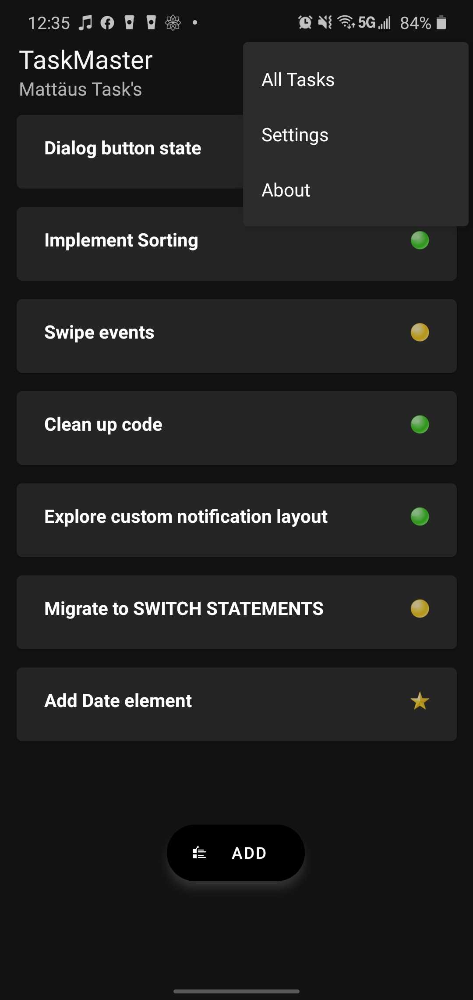
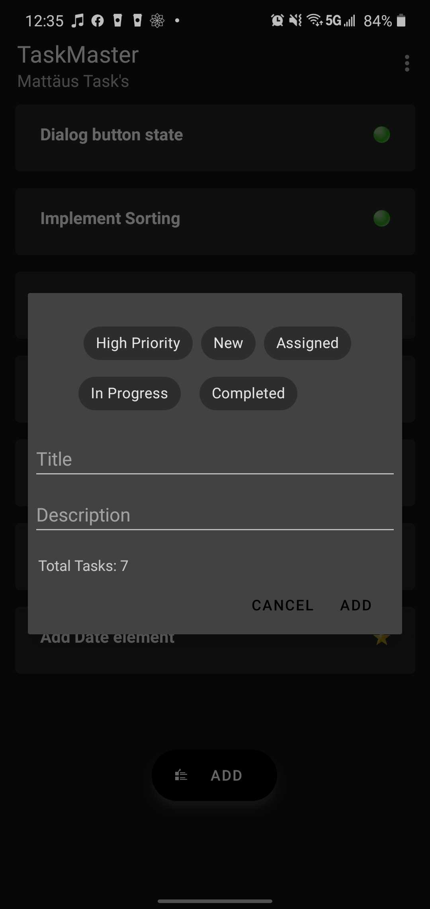
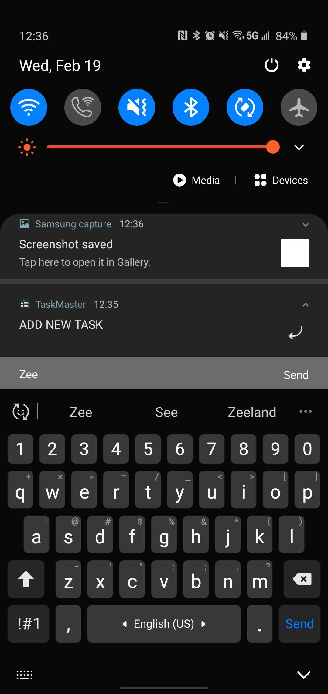
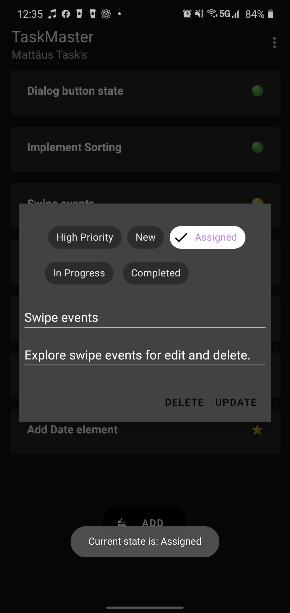
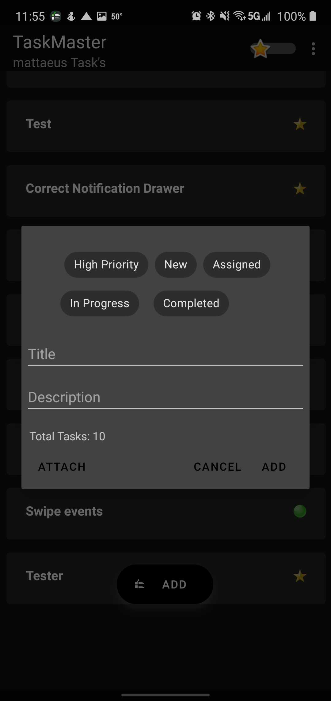
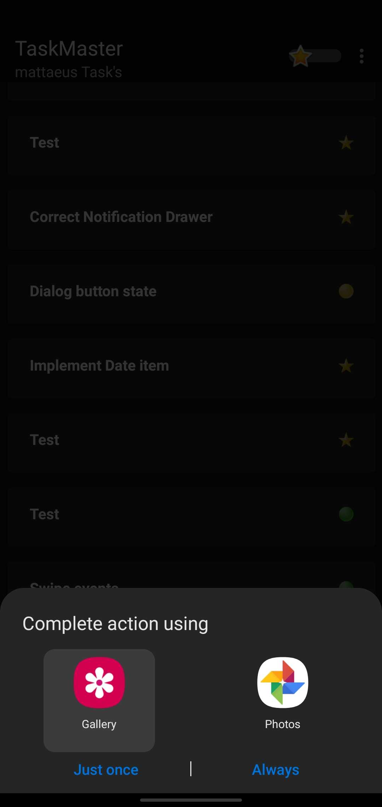
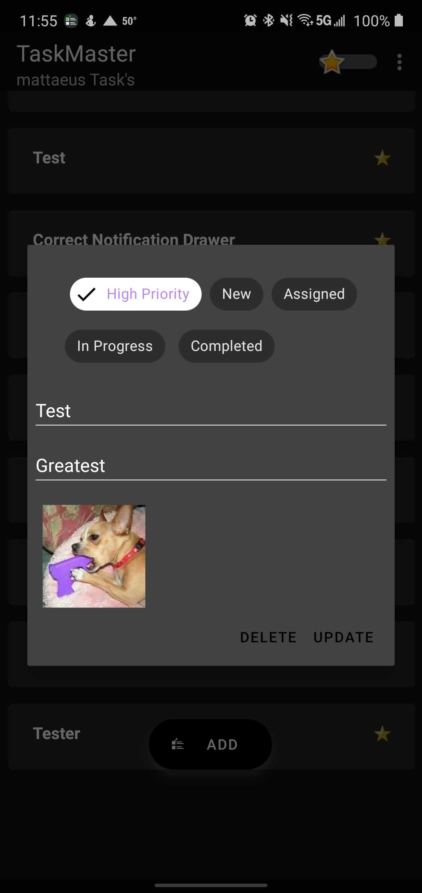

# taskMaster

## Day One Tasks

- Create home page - Recycler view, toolbar with title and subtitle as well as with 3 menu items all fully functional to an about, all tasks, and settings.

- Add a Task - Dialog with ChipGroup, 2 EditText for entering title as well as description.

- ADD Task from Notification drawer.

- Task Detail - Dialog with ChipGroup, and 2 EditText fields.

## Completed day three tasks

-Implemented recycler view, adding tasks in main as well as clicking even handling and passing of information.

## Completed day 4 tasks and beyond.

Task Model and Room
Following the directions provided in the Android documentation, set up Room in your application, and modify your Task class to be an Entity.

Add Task Form
Modify your Add Task form to save the data entered in as a Task in your local database.

Homepage
Refactor your homepage’s RecyclerView to display all Task entities in your database.

Detail Page
Ensure that the description and status of a tapped task are also displayed on the detail page, in addition to the title. (Note that you can accomplish this by passing along the entire Task entity, or by passing along only its ID in the intent.)

## Completed S3, Cognito, DynamoDB
Implemented all requirements fully including final requirement of S3 uploads of attached images to tasks and presenting preview of it on detail view.

### Attach option on new task

### Image prompt for selection

### Preview image populated straight from S3 bucket and not locally

[APK FILE](app-debug.apk)