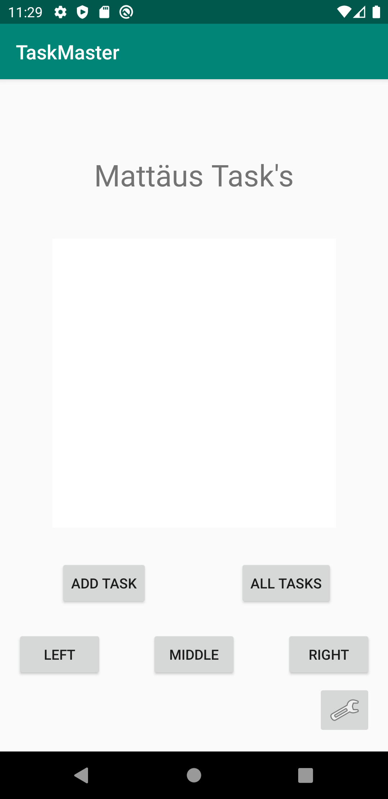
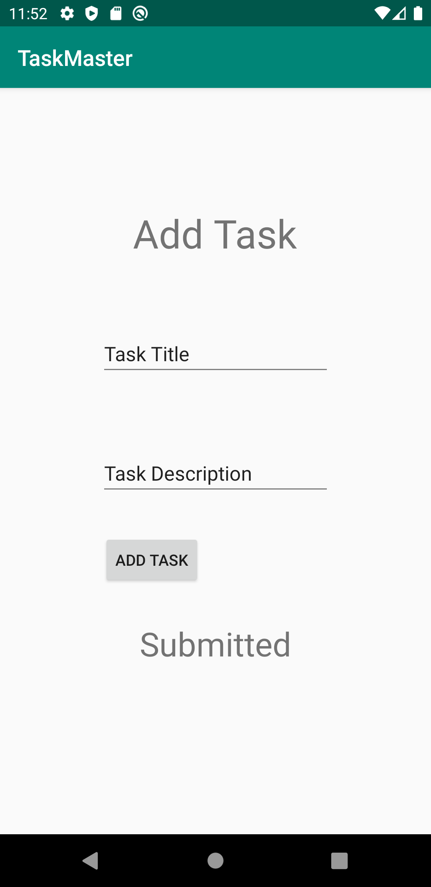
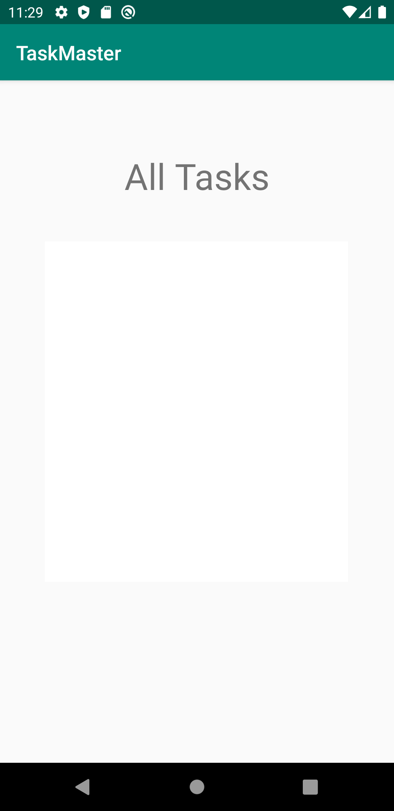
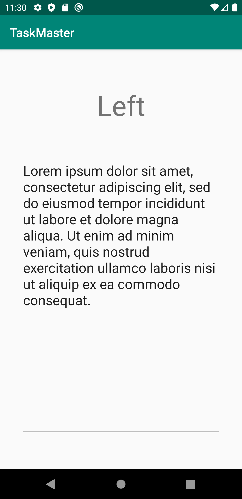

# taskMaster

## Day One Tasks

- Create home page - View contains a text view, image view and 2 buttons, one button navigates to add a task view and the other to all tasks.

- Add a Task - Contains a button to add tasks and 2 text fields, 1 for the title of a task another for the description

- All Tasks - Contains a text view as well as image view.

- Task Detail - Contains an EditText view as well as MultiLine view. 

Completed day two tasks

-Detail page created, populates title from text contained in button.
-Settings page created, has EditText and button, saving changes Main page to show username saved.